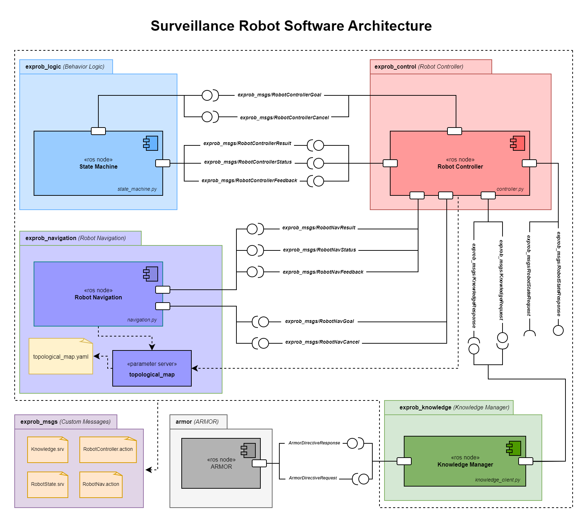

<div align="center"><a href="https://unige.it/en/">

</a></div>

<h1 align="center"> Experimental Robotics Lab Project 2022 </h1>

>**Author: Omotoye Shamsudeen Adekoya**  
 **Email: <adekoyaomotoye@gmail.com>** </br>
 **Student ID: 5066348**

## Outline

1. [Introduction](#intro)
1. [Description of the Software Architecture](#desc)
    * [Component Diagram](#comp-diag)
    * [State Diagram](#state-diag)
    * [Sequence Diagram](#seq-diag)
2. [Installation and Running Procedure](#install-run)
    * [Installation](#install)
    * [Running](#run)
3. [System Limitations and Possible Improvements](#limits)
4. [Project timeline](#timeline)

> _read the [docs](https://omotoye.github.io/Experimental-Robotics-Project.2022/index.html) for a more comprehensive detail about the [code-base (api)](https://omotoye.github.io/Experimental-Robotics-Project.2022/api.html). You can find everything contained in this readme and more in the docs..._

<a name="intro"></a>

# Introduction

This project is the first version _(assignment 1)_ of the _Experimental Robotics Course_ of a [Robotics Engineering](https://corsi.unige.it/en/corsi/10635) Master's degree at the [University of Genoa](https://unige.it/en/). It is a simulation scenario of a surveillance robot being deployed in an indoor environment. The first version covers the creation of the architecture by putting in place some _nodes/components_ that don't exactly perform the task that they are specified to carry out but act as a template to be built on in later versions of the project. The architecture also contains some component that does exactly what they are always going to be required to do in the entire lifetime of the architecture.

**The Surveillance Scenario is as follows;**

The robot is supposed to survey an environment with rooms connected by corridor(s). The robot would move around the corridor until there's a **reachable** room that needs to be **urgently** visited _(i.e. the room has not been visited/surveyed for a while)_, when such a room exists, the robot navigates to that room and survey's the room for a set amount of time and then leaves back to the corridor. if there's no reachable urgent room available after a while of surveying a corridor, the robot moves to any other available corridor if it exists, otherwise, it keeps on surveying the current corridor. This sequence is continued infinitely until the battery of the robot goes low. If the robot battery goes low at any point in this sequence, whatever action the robot had planned to do is preempted and the robot navigates to the charging stations, it remains there until the battery becomes full and then it goes back to surveying the area. There's an ontology node that reasons about things like what rooms are reachable when a room needs to urgently be visited... basically facts about the surveillance scenario. There's also another node that manages the internal state of the robot like the battery life. All of these nodes/components would be described more extensively in the next section. For more information about the specific requirements of the first version of this project _(assignment 1)_, consult the [assignment specification](docs/assignment-specification.pdf) pdf document.

<a name="desc"></a>

## Description of the Software Architecture

<a name="comp-diag"></a>

### Component Diagram

The nodes in this architecture are grouped in packages based on the similarities of the functionalities they perform. They would each be highlighted and described comprehensively.



The Software Architecture contains 6 packages, each of which has a specific task to take care of:

1. Behavioural Logic (`exprob_logic`)
2. Robot Controller (`exprob_control`)
3. Robot Navigation (`exprob_navigation`)
4. Knowledge Manager (`exprob_knowledge`)
5. Custom Messages (`exprob_msgs`)
6. Armor (`armor`)

#### Behavioural Logic

This package contains the state machine scripts, the scripts were shared into two; the states and logic scripts. In the states script, this is where the state class of each of the state of the state machine is defined (more about the states of the state machine later in the readme). In each state, only one action is performed which is calling the action server in the Robot Controller to perform the task. No type of computation is performed in the state script, it only calls the action to perform the required task per state. It was done this way to define the exact role of the state machine package which is to switch from one state to another. The logic script is where all the transitions and the overall structure of the state machine are defined.

#### Robot Controller

This package contains the class definition of a Robot Controller; this robot controller has an action server that takes command of action to perform from the state machine. It is in charge of calling each of the components required to perform an action. It is also in charge of storing information about the state of the robot. (ie where the robot is at, the battery life and it's management etc)

#### Robot Navigation

As the name implies, it is in charge of navigating the robot to a required point of interest. This package has a YAML file called `topological_map.yaml`. This file contains the coordinates of each of the so-called point of interest and what doors are connected to them. It is structured in the format shown below.

```yaml
E: # Location
  doors: [D5, D6] # doors connection to the location
  x_axis: 7.0 # Coordinates of the location. 
  y_axis: 8.0

C1:
  doors: [D1, D2, D5, D7]
  x_axis: 2.0
  y_axis: 1.0
R1:
  doors: [D1]
  x_axis: 3.5
  y_axis: 5.5
# and many more...
```

The id of the point of interest (ie R1...) is the keyword that is being received by the navigation node from the Robot Controller. The navigation node uses the id to extract the target coordinate (x,y) and navigate to that coordinate. However the navigation has not been implemented in this version of the project, so the navigation only prints this coordinate to the terminal and doesn't do anything with it; for now, it simple waste time for a random amount of seconds (from 1 to 10 sec).

#### Knowledge Manager

<!-- This package is perhaps the most important part of this project; it contains the Oracle Object and the Knowledge Manager.

From the goal objectives of the project, the oracle is in charge of generating hints for the robot to detect randomly from the rooms, and most importantly, the Oracle has the information about the correct hypothesis for the who, what and where of the killer in the game.

For managing the knowledge in (hint and hypothesis) OWL Ontology is used and to communicate with the Cluedo OWL Ontology, an external package called ARMOR is used. The knowledge manager helps to save and generate the required request message to the ARMOR service to perform actions such as **Update the Ontology, Query the Ontology for Complete and Consistent Hypothesis because this is required to be done with a sequence of commands (for example to add a hint, you have to add, disjoint the hint class, and call the reasoner) the knowledge manager serves as a medium to perform this sequence of action depending on the required task.

When the simulation is started the Oracle which knows all the consistent and complete hypotheses, selects the correct one out of them (randomly) and the robot is supposed to find out what it is by accumulating hints gotten from rooms. The hints are stored in a YAML file with the format shown below, it is then loaded into a parameter server which is called by both the knowledge manager and the oracle object.

hints:
  - HP0:
    - who: "Toye"
    - what: "Knife"
    - where: "Library"
  - HP1:
    - who: "Tom"
    - what: "Knife"
    - where: "Ball Room"
    - what: "Cutlass"
  - HP2:
    - who: "Jerry"
    - where: "Hall"
# and more...
 -->
#### Custom Messages

This package was created specifically for storing all the custom message that was generated for interfacing between components in this project.

##### Action Messages

Two action messages was generated: `RobotController.action and`RobotNav.action`

* `RobotController.action`:

```bash
# goal definition
string goal # `check map`, `update topology`, `get next poi`, `goto room`, `goto corridor`, `goto recharge point`, `survey room`, `survey corridor`, `charge battery`
---
# result definition
string result 
---
# feedback
string task_state # base message that would be changed later based on project requirements. 
```

The `goal` is the part of the message which the state machine uses to indicate what action the controller should perform. it could be to _check map, update topology, get next poi, goto room_ etc.

The result could be success or failure,

* `RobotNav.action`:

```bash
#goal definition
string poi  # point of interest (where to navigate to)
---
#result definition
bool success 
float32 x_cord
float32 y_cord
---
#feedback
float32 x_cord
float32 y_cord
```

The `poi` is the point of interest which represent where the robot should navigate to. The navigation components takes this name and gets the coordinates of the point of interest from the `topological_map.yaml` parameter server.

The result is sucess as `True` of `False` and the coordinate it just navigated to.

The feedback is the coordinate where the robot is at in realtime.

##### Service Messages

Two service messages: `Knowledge.srv`, `RobotState.srv`

* `Knowledge.srv`:

```bash
string goal # the goal could be `update topology`, `get next poi`, `update now`, `update robot location`, `update visited location`
string robot_location
---
string result # result of the service required by the knowledge server. 
string next_room_of_interest
string next_corridor_of_interest
```

The `goal` could be to update the topology into the ontology, get the next point of interest, updated the current time into the ontology, update the robot location into the ontology and update the visited locations into the ontology.

Based on the request from the Robot Controller, it can also return a response of the next room or corridor of interest.

* `RobotState.srv`

```bash
string goal # possible goals: `` -> empty message equivalent to just `query state`, `stop surveillance` 
float32 battery_level
bool battery_charging
string robot_is_in
bool low_battery
bool stop_call
bool full_battery
---
bool success
float32 battery_level
bool battery_charging
string robot_is_in
bool low_battery
bool stop_call
bool full_battery
```

The `goal` could be empty message which is equivalent to `query state` or it could be `stop surveillance` which is the way to stop the surveillance scenario.

The response to this service is the state of the robot regardless of the request sent to the server.

#### ARMOR

The ARMOR package is an external package used to communicate with the Cluedo OWL ontology, it is a ROS wrapper that helps to make this communication possible. For more information about ARMOR [click here](https://github.com/EmaroLab/armor)

<a name="state-diag"></a>

### State Diagram

<a name="seq-diag"></a>

### Sequence Diagram

<a name="install-run"></a>

## Installation and Running Procedure

> *NB: The instructions below are meant for packages that are written for ROS Noetic Ninjemys.*

## Compile

<a name="install"></a>

There are two options to compile this package: 

**Option 1:**
Download the installation script and run with the command below

```bash
# Download the script 
wget https://raw.githubusercontent.com/Omotoye/Experimental-Robotics-Project.2022/main/ros_install.sh

# make the script executable 
chmod +x ros_install.sh

# run the script
./ros_install.sh # follow the instruction, by entering `1` for version 1 of this project.
```

**Option 2:** 
Do the compilation yourself :(

First, you create a folder for your catkin workspace

```bash
mkdir -p ~/catkin_ws/src
```

Clone the package repository

```bash
cd ~/ros_ws/src
git clone https://github.com/Omotoye/Experimental-Robotics-Project.2022.git
git checkout v1.0.0
```

Once the package has been successfully cloned, you then build the workspace

```bash
source /opt/ros/noetic/setup.bash
cd ~/catkin_ws/
catkin_make  # or `catkin build` if you want to use catkin build to compile the workspace
```

### Dependencies

>**NB:** *The dependency installation is not included in the installation script, so if you used the installation script you still have to follow the steps below*

This project depends on two external packages

* smach
* armor

To install **armor** consult the [armor](https://github.com/EmaroLab/armor) installation repository

>**NB:** *follow the instructions in this [issue page](https://github.com/EmaroLab/armor/issues/7) to install armor for noetic devel*

Run the command below to install **smach**

```bash
sudo apt-get install ros-noetic-smach ros-noetic-smach-ros ros-noetic-executive-smach ros-noetic-smach-viewer
```

## Launch

<a name="run"></a>

Step 1: Open two terminal and source the setup.bash file in the both of them, if you followed the steps above or you used the installation script, then you can enter the command below.

```bash
source ~/catkin_ws/devel/setup.bash
```

If you didn't follow the initial steps because you already have a workspace, trace a path from your home directory to your catkin workspace down to your setup.bash file. An example is shown below, ***THIS WILL NOT WORK FOR YOU, IT IS JUST AN EXAMPLE TO SHOW HOW IT CAN BE DONE***

```bash
source /home/omotoye/catkin_ws/devel/setup.bash
```


Step 2: run the **knowledge Package** launch file

```bash
roslaunch exprob_knowledge knowledge.launch
```

Step 3: run the **Surveillance** launch file in the second terminal, this would run all the remaining required nodes and load all the required YAML files in the parameter server.

```bash
roslaunch exprob_logic surveillance.launch
```

If all the above steps for compiling were done right the simulation should start.

**Optional:**
if you want to view the state transitions of the state machine with smach viewer, run the command below in a new terminal

```bash
rosrun smach_viewer smach_viewer.py
```

>__*to see a video of the demo of this project*__ [click here](https://drive.google.com/file/d/13pLY4IIqIsQ1HZv1hQkM_oqDcez-vS5s/view?usp=sharing)


<a name="limits"></a>

## System Limitations and Possible Improvements

<a name="timeline"></a>

## Project Timeline

### 25/01/2023

* [x] Start of the project, initialize the GitHub Repo

### 02/02/2023

* [x] Install all the required software and packages on my WSLg.

### 03/02/2023 - 05/02/2023

* [x] Study the class material and watch some class recordings.
* [x] Understand and Develop a plan for the Project 1 of the course.

### 07/02/2023

* [x] Make a paper sketch of the intended architecture.
* [x] Make a paper sketch of the states and transitions in the state machine
* [x] Define the structure of the state machine with smach.
* [x] Test the state machine by putting a dummy task in each of the states.

### 09/02/2023

* [x] Define the _messages/services/actions_ required for the interfaces in the architecture.
* [x] Create a server node to take instructions from the state machine and robot controller and then interface with aRMOR service.

### 10/02/2023

* [x] Complete all the nodes required for Phase 1 of the surveillance senario.
* [x] Test the architecture to see that phase 1 works as intended.  

### 11/02/2023

* [x] Create a control package for the robot state node and robot controller node.
* [x] Create a navigation package for the dummy navigation node.

### 12/02/2023 - 19/02/2023

* [x] Integrate the controller, robot-state, knowledge and navigation with the state machine based on properly defined messages for interfacing.
* [x] Complete all the nodes and logic required for the Phase 2 of the surveillance senario.
* [x] Complete all the nodes and logic required for the Phase 3 of the surveillance senario.

### 20/02/2023 - 22/02/2023

* [x] Test/Fix bugs/Refactor the architecture to see that all the nodes are working together as intended for the surveillance senario.

### 22/02/2023 - 23/02/2023

* [x] Refactor the code base for clarity and readability
* [x] Add proper commenting to the code base.

### 23/02/2023 - 24/02/2023

* [x] Create a UML diagram of the proposed architecture.
* [x] Create the State Diagram.

### 25/04/2023 - 27/02/2023

* [ ] Add a Sphinx documentation to the repo
* [ ] Create the Sequence diagram
* [ ] Complete the readme as per assignment requirements.

_**End of version-1.0.0 of the Project...**_
